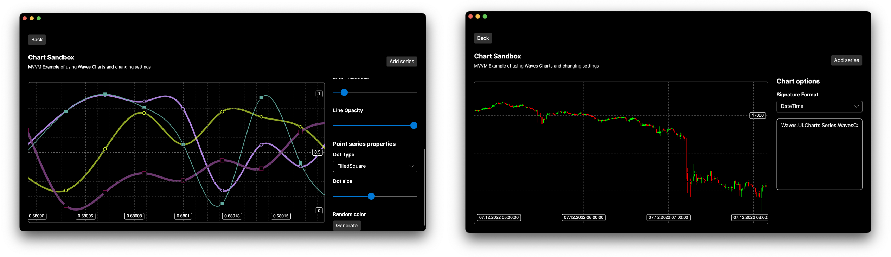

##   Waves UI Charts
  

### 📚 About Waves

**Waves** is a cross-platform framework designed for flexible developing of desktop, mobile applications and web-services.

> **Warning**
> This project currently in progress. There will be significant changes before the final release.

> **Note**
> This repository is open for contributing. If you want to learn how to develop data visualization software, then welcome! :)
> Just email me: khek@ambertape.ru

> **Note**
> Also feel free to write issues. It will be a good motivation to develop project.

### 📒 About Waves.UI.Charts



**Waves.UI.Charts** is a package for developing cross-platform charts/graphs-viewing applications. It provides a simple and fast cross-platform charting tool.

### 🚀 Getting started

Like all Waves libraries Waves.UI.Charts distributes via **NuGet**. You can find the packages [here](https://www.nuget.org/profiles/Waves).

Or use these commands in the Package Manager to install Waves.Core manually:

```
Install-Package Waves.UI.Charts
Install-Package Waves.UI.Avalonia.Charts
```

### ⌨️ Usage basics

After installing the package you just need add chart control to XAML:

```xml
<controls:WavesPointSeriesChart Series="{Binding Series}"
                                XMin="{Binding XMin}"
                                XMax="{Binding XMax}"
                                YMin="{Binding YMin}"
                                YMax="{Binding YMax}"/>
```

And add the appropriate fields to the viewmodel:

```c#
    /// <summary>
    /// Gets or sets X Min.
    /// </summary>
    [Reactive]
    public double XMin { get; set; }

    /// <summary>
    /// Gets or sets X Max.
    /// </summary>
    [Reactive]
    public double XMax { get; set; }

    /// <summary>
    /// Gets or sets Y Min.
    /// </summary>
    [Reactive]
    public double YMin { get; set; }

    /// <summary>
    /// Gets or sets Y Max.
    /// </summary>
    [Reactive]
    public double YMax { get; set; }
    
    /// <summary>
    /// Gets or sets series.
    /// </summary>
    [Reactive]
    public ObservableCollection<IWavesPointSeries> Series { get; set; }
```

Chart initialization looks like this:
```c#
    var x = new double[length];
    var y = new double[length];
    var random = new Random();
    for (var i = 0; i < length; i++)
    {
        x[i] = startX + i * step;
        y[i] = Math.Sin(i);
    }
    
    var series = new WavesPointSeries(x, y)
    {
        Color = WavesColor.Red,
        Type = SelectedSeriesType,
        DotType = WavesDotType.FilledCircle,
    };
    
    XMin = x.Min();
    XMax = x.Max();
    YMin = y.Min();
    YMax = y.Max();
    Series.Add(series);
```


**⚠️ _Other documentation will be available soon._**

### 📋 Licence

Waves.UI.Charts is licenced under the [MIT licence](https://github.com/waves-framework/waves.ui.charts/blob/master/license.md).
